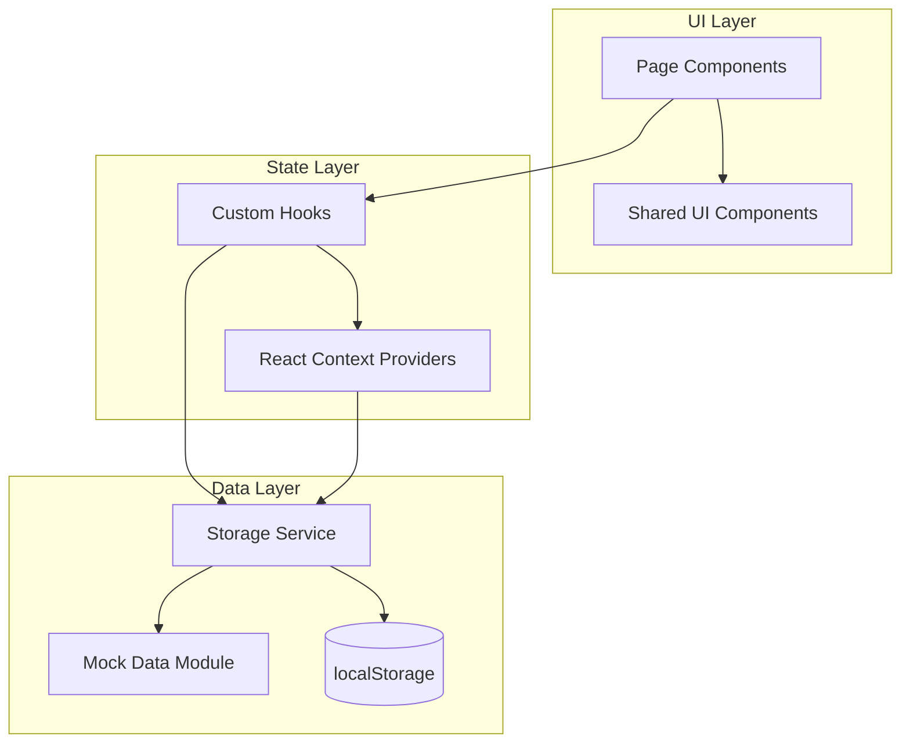
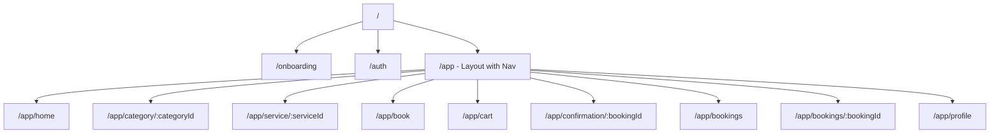

# Design Document: Cleaning Booking Demo

## Overview

This design describes a responsive, mobile-first web application for a cleaning services company. Customers browse service categories, view details with pricing tiers, add services to a cart, and book them for a specific date, time, and address. The company travels to the customer's location.

The app is a single-page application (SPA) built with **React 18** and **TypeScript**, using **React Router v6** for client-side routing. All data is simulated — no backend exists. **localStorage** serves as the persistence layer for authentication, cart, bookings, and user profile. Styling uses **CSS Modules** with CSS custom properties (design tokens) for theming.

**Key design decisions:**
- **React + TypeScript**: Widely adopted, strong typing catches bugs early, large ecosystem of UI primitives.
- **React Router v6**: Standard SPA routing with layout routes for navigation shells.
- **CSS Modules + custom properties**: Scoped styles avoid collisions; custom properties enable easy brand swaps without a CSS-in-JS runtime.
- **Vite**: Fast dev server and build tool, zero-config for React+TS projects.
- **No component library**: Custom components keep the bundle small and give full control over the premium visual identity. Icons from `react-icons`.
- **localStorage as "backend"**: Simplest persistence for a demo — no server, no async complexity beyond simulating it.

## Architecture

The application follows a layered architecture separating UI, state, and data concerns.



### Routing Structure



**Route guards:**
- Unauthenticated users are redirected to `/auth`.
- First-time users (no `onboarding_complete` flag in localStorage) are redirected to `/onboarding`.
- Authenticated users accessing `/auth` are redirected to `/app/home`.

### Project Structure

```
src/
├── main.tsx                  # Entry point, renders App
├── App.tsx                   # Router setup, context providers
├── routes.tsx                # Route definitions
├── theme/
│   ├── tokens.css            # CSS custom properties (design tokens)
│   └── global.css            # Reset, typography, global styles
├── components/
│   ├── Button/
│   ├── Card/
│   ├── Badge/
│   ├── Input/
│   ├── Calendar/
│   ├── TimeSlotPicker/
│   ├── BottomNav/
│   ├── TopNav/
│   ├── PromoBanner/
│   └── EmptyState/
├── pages/
│   ├── Onboarding/
│   ├── Auth/
│   ├── Home/
│   ├── CategoryListing/
│   ├── ServiceDetail/
│   ├── BookingForm/
│   ├── Cart/
│   ├── Confirmation/
│   ├── MyBookings/
│   └── Profile/
├── layouts/
│   └── AppShell.tsx          # Responsive nav shell (bottom/top nav)
├── context/
│   ├── AuthContext.tsx
│   ├── CartContext.tsx
│   └── BookingContext.tsx
├── hooks/
│   ├── useAuth.ts
│   ├── useCart.ts
│   ├── useBookings.ts
│   └── useMediaQuery.ts
├── services/
│   ├── storage.ts            # localStorage read/write helpers
│   ├── authService.ts        # Simulated auth logic
│   ├── bookingService.ts     # Booking CRUD, reference number generation
│   └── cartService.ts        # Cart CRUD
├── data/
│   ├── categories.ts         # Service category definitions
│   ├── services.ts           # All service listings with tiers
│   └── promotions.ts         # Promo banner data
├── types/
│   └── index.ts              # Shared TypeScript interfaces
└── utils/
    ├── referenceNumber.ts    # CLN-XXXXXX generator
    └── validation.ts         # Form validation helpers
```

## Components and Interfaces

### Shared UI Components

**Button** — Primary action button with variants (primary, secondary, outline, ghost). Supports loading state.

```typescript
interface ButtonProps {
  variant: 'primary' | 'secondary' | 'outline' | 'ghost';
  size: 'sm' | 'md' | 'lg';
  loading?: boolean;
  fullWidth?: boolean;
  children: React.ReactNode;
  onClick?: () => void;
  type?: 'button' | 'submit';
  disabled?: boolean;
}
```

**Card** — Container with consistent border-radius, shadow, and padding. Used for service listings, booking summaries.

```typescript
interface CardProps {
  children: React.ReactNode;
  onClick?: () => void;
  className?: string;
  hoverable?: boolean;
}
```

**Badge** — Small count indicator for cart icon.

```typescript
interface BadgeProps {
  count: number;
}
```

**Input** — Text input with label, error state, and helper text.

```typescript
interface InputProps {
  label: string;
  value: string;
  onChange: (value: string) => void;
  type?: 'text' | 'email' | 'password';
  error?: string;
  placeholder?: string;
  required?: boolean;
}
```

**Calendar** — Date picker showing a month grid. Only future dates are selectable.

```typescript
interface CalendarProps {
  selectedDate: string | null;       // ISO date string
  onSelectDate: (date: string) => void;
  minDate?: string;                  // defaults to today
}
```

**TimeSlotPicker** — Horizontal scrollable list of hourly slots (8 AM – 6 PM).

```typescript
interface TimeSlotPickerProps {
  selectedSlot: string | null;       // e.g. "10:00"
  onSelectSlot: (slot: string) => void;
}
```

**BottomNav / TopNav** — Navigation components. BottomNav renders on mobile (≤768px), TopNav on desktop (>768px). Both highlight the active route and show a cart badge.

**PromoBanner** — Carousel/slider for promotional content on the Home screen.

**EmptyState** — Illustration + message + CTA for empty lists (cart, bookings).

### Page Components

Each page is a route-level component that composes shared components and uses hooks for data access.

| Page | Route | Key Responsibilities |
|------|-------|---------------------|
| Onboarding | `/onboarding` | Swipeable slides, "Get Started" / "Skip" buttons, sets `onboarding_complete` flag |
| Auth | `/auth` | Login/Signup tabs, form validation, calls authService |
| Home | `/app/home` | Greeting, category grid, promo banner, featured services |
| CategoryListing | `/app/category/:categoryId` | Filtered service list for a category |
| ServiceDetail | `/app/service/:serviceId` | Service info, tier selection, "Book Now" and "Add to Cart" |
| BookingForm | `/app/book` | Calendar, time slots, address form, summary, confirm |
| Cart | `/app/cart` | Cart item list, total, remove items, "Book All" |
| Confirmation | `/app/confirmation/:bookingId` | Success indicator, booking summary, navigation buttons |
| MyBookings | `/app/bookings` | Upcoming/Past tabs, booking cards, expand for details |
| Profile | `/app/profile` | User info, edit name, saved addresses, logout |

### Context Providers

**AuthContext** — Manages current user state, login/signup/logout actions, session persistence.

```typescript
interface AuthContextValue {
  user: User | null;
  isAuthenticated: boolean;
  login: (email: string, password: string) => { success: boolean; error?: string };
  signup: (email: string, password: string, name: string) => { success: boolean; error?: string };
  logout: () => void;
  updateProfile: (updates: Partial<User>) => void;
}
```

**CartContext** — Manages cart items, add/remove/clear operations, item count.

```typescript
interface CartContextValue {
  items: CartItem[];
  itemCount: number;
  totalPrice: number;
  addItem: (item: CartItem) => void;
  removeItem: (itemId: string) => void;
  clearCart: () => void;
}
```

**BookingContext** — Manages booking records, creation, and retrieval.

```typescript
interface BookingContextValue {
  bookings: Booking[];
  createBooking: (details: BookingDetails) => Booking;
  getBooking: (id: string) => Booking | undefined;
  upcomingBookings: Booking[];
  pastBookings: Booking[];
}
```

### Service Layer

**storage.ts** — Generic localStorage wrapper with JSON serialization.

```typescript
function getItem<T>(key: string, defaultValue: T): T;
function setItem<T>(key: string, value: T): void;
function removeItem(key: string): void;
```

**authService.ts** — Simulated authentication. Stores user accounts as an array in localStorage. Validates credentials, checks for duplicate emails.

**bookingService.ts** — Creates booking records with generated reference numbers. Reads/writes bookings array from localStorage.

**cartService.ts** — Reads/writes cart items from localStorage. Calculates totals.

**referenceNumber.ts** — Generates booking reference numbers in format `CLN-XXXXXX` (6 alphanumeric characters).

```typescript
function generateReferenceNumber(): string;
```

## Data Models

```typescript
// Service category identifiers
type CategoryId = 'car-wash' | 'house-cleaning' | 'carpet-upholstery' | 'window-cleaning' | 'specialized';

interface ServiceCategory {
  id: CategoryId;
  name: string;
  icon: string;           // icon identifier for react-icons
  description: string;
}

interface PricingTier {
  id: string;
  name: string;           // e.g. "Basic", "Standard", "Premium"
  price: number;
  description: string;
  includes: string[];     // list of what's included
}

interface Service {
  id: string;
  categoryId: CategoryId;
  name: string;
  description: string;
  shortDescription: string;
  duration: string;       // e.g. "1-2 hours"
  image: string;          // placeholder image URL or icon
  tiers: PricingTier[];
  featured: boolean;
}

interface User {
  id: string;
  email: string;
  password: string;       // stored as-is for demo (no hashing needed)
  name: string;
  savedAddresses: Address[];
}

interface Address {
  id: string;
  street: string;
  city: string;
  zipCode: string;
  label?: string;         // e.g. "Home", "Office"
}

interface CartItem {
  id: string;             // unique cart item ID
  serviceId: string;
  serviceName: string;
  tierId: string;
  tierName: string;
  price: number;
}

interface BookingDetails {
  services: CartItem[];
  date: string;           // ISO date string
  timeSlot: string;       // e.g. "10:00"
  address: Address;
  notes?: string;
}

interface Booking {
  id: string;
  referenceNumber: string; // CLN-XXXXXX format
  services: CartItem[];
  date: string;
  timeSlot: string;
  address: Address;
  notes?: string;
  totalPrice: number;
  status: 'upcoming' | 'past';
  createdAt: string;       // ISO datetime
}

interface Promotion {
  id: string;
  title: string;
  description: string;
  discount: string;        // e.g. "20% OFF"
  categoryId?: CategoryId;
  serviceId?: string;
}
```

### localStorage Key Schema

| Key | Type | Description |
|-----|------|-------------|
| `cln_onboarding_complete` | `boolean` | Whether onboarding has been viewed |
| `cln_users` | `User[]` | All registered user accounts |
| `cln_current_user` | `string \| null` | Email of logged-in user |
| `cln_cart` | `CartItem[]` | Current cart contents |
| `cln_bookings` | `Booking[]` | All booking records |
